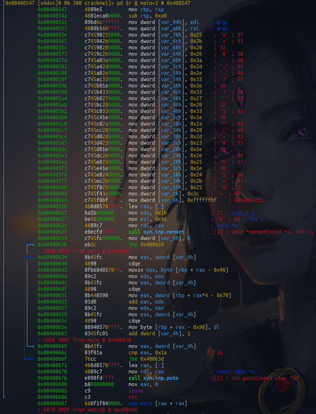
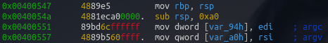
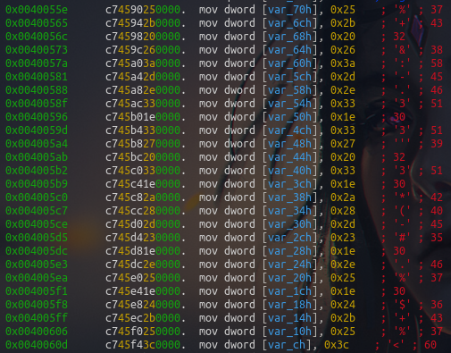
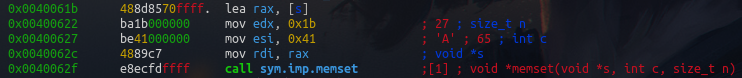
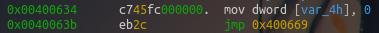
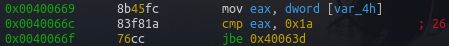
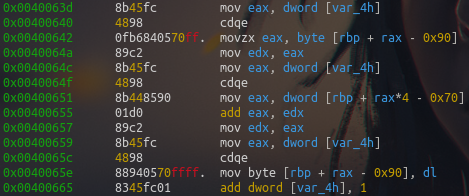
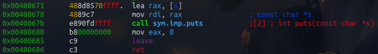

# crackme1 writeup

Hi there, this is my write up for the crackme1 file. If you read the hint in the website you'll see that it suggets that you should run the file. If you do, it gives the flag. As simple as that.

```bash
$ ./crackme1

flag{...}
```

Even tho the flag is really easy to get, the way the binary generates the flag is quite interesting.

If you open the file in redare2 and analyze it, after jumping to the disassembly view, you'll see something a bit weird for me



Here we can see the creation of a new stack frame and we can see that the arguments of the main function are passed the addresses `rbp - 0x94` and `rbp - 0xa0`



And after that, we can see that from address `rbp - 0x70` to `rbp - 0xc` are filled with constants, redare2 is so awesome that it shows us the ASCII representation right on the side. These constants are later gonna be used to generate the flag.


These instruction right here are just setting the parameters for the `memset` function, we can see that it is setting an array with `27` elements and it's putting `0x41` which is the `A` character inside.


After that the binary is setting up a loop, the counter for that loop will be at address `rbp - 0x4`, in the visual mode redare2 show this address as variable with the name `var_4h`. 



After setting the counter me jump to a comparison where we check the value of the counter against 26, remeber that ´memset´ created an array with 27 elements, so 26 and the null byte to end the string, create the 27 characters long string.


The very first value of the counter is `0`, `0` is less than 26 so it's gonna jump to the address `0x0040063d`. This next section can be a bit confusing, so don't worry is you don't fully understand the complete logic of these instructions


In really basic words, it's using the counter as an index to target one value in the array created by the memset function, then, it's taking the integer representation of that character and then adding that value to the array of constants that we saw before in the exact same index. Basically it's changing the ASCII values in the array of constants by incrementing their value using the array created by `memset`, that's how the flag is created.

If you don't understand me, just read those instructions a few times until you get it, just remember that `rbp + rax - 0x90` is the array created by `memset` and `rbp + rax*4 - 0x70` is the array of constants.



After that, all that's left is to print the flag and exit the program
